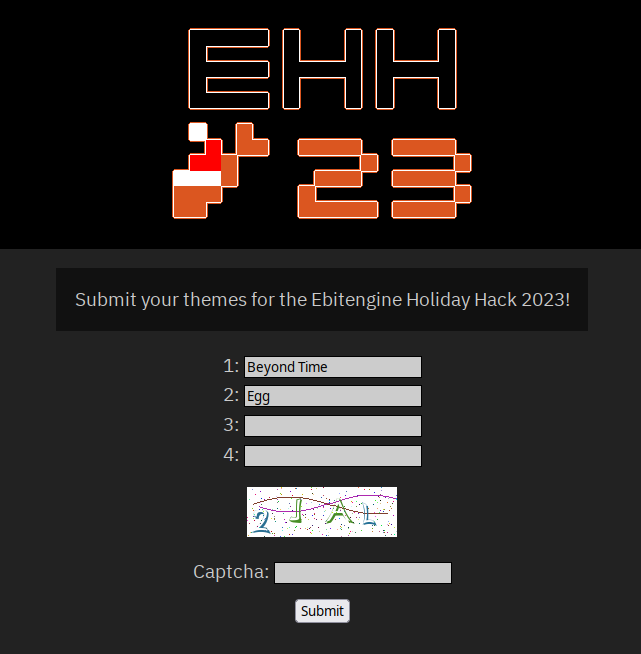

# Jam Theme Submission
This software provides a web server for receiving theme submission entries for a game jam or otherwise.

## Settings
A settings JSON file will be generated on program start. The available fields are:

  * `Title`
    * The title to use for the theme submission.
  * `Text`
    * Descriptive text shown on the submission page.
  * `Entries`
    * A number of entries to allow submission for. Obviously an end-user could submit more than once.
  * `UseCaptcha`
    * A boolean to indicate if a captcha should be required for submission or not. Note that captions reset only after 5 minutes have elapsed.
  * `UseHeader`
    * A boolean to indicate if a header image should be used. The image should be stored at `static/header.png`.